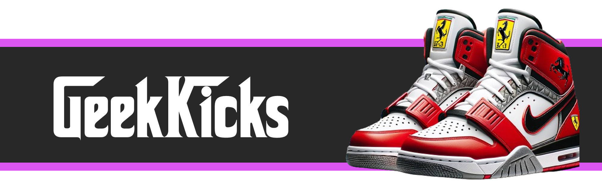

<h1 align="center">
    
</h1>

<h4 align="center">
  🚀 Projeto Geekicks
</h4>
  <p align="center">E-commerce de tênis ultra personalizados por IA.</p>

<p align="center">
  

  
  
  <a href="https://github.com/felipeAguiarCode/geekkicks-app/commits/main">
    
  </a>

  <a href="https://github.com/WallysonGalvao/rocketseat-gobarber/issues">
    
  </a>

  
</p>

<p align="center">
  <a href="#-projeto">Projeto</a>&nbsp;&nbsp;&nbsp;|&nbsp;&nbsp;&nbsp;
  <a href="#rocket-tecnologias">Tecnologias</a>&nbsp;&nbsp;&nbsp;|&nbsp;&nbsp;&nbsp;
  <a href="#rocket-executando">Executando</a>&nbsp;&nbsp;&nbsp;|&nbsp;&nbsp;&nbsp;
  <a href="#memo-licença">Licença</a>
</p>
<br>

## 💻 Projeto

Esse projeto foi desenvolvido para estudos pessoais. Trata-se de um projeto fullstack para uma e-commerce ficticio, a GeekKicks, o projeto consiste na parte frontend(Angular) e backend(NodeJs com NestJS).

## 🎨 Layout

<p align="center">
    
</p>

Você pode utilizar a seguinte URL para visualizar todas as telas: [Visualizar](https://www.figma.com/0)

## :rocket: Tecnologias

Esse projeto foi desenvolvido com as seguintes tecnologias:

- [Typescript](https://www.typescriptlang.org/)
- [Node.js](https://nodejs.org/en/) | [NestJs](https://nestjs.com)
- [Angular](https://angular.dev/)
- [PostgreSQL](https://www.postgresql.org/) | [TypeORM](https://typeorm.io/)

## :notebook: Executando

Dentro do **README** de cada subpasta do projeto é detalhado como executar as aplicações separadamente.

```bash
# Clone este repositório
$ git clone https://github.com/felipeAguiarCode/geekkicks.git

# Acesse a pasta do projeto no seu terminal/cmd
$ cd geekkicks/backend

# Instale as dependências
$ npm install

# Execute a aplicação
$ npm run start
```

Realizar os comandos acima para as demais pastas **[frontend e backend]**.

## :bookmark_tabs: Documentação

Esse projeto inclui uma pasta `docs` com mais detalhes sobre:

1. [semantic.commits] (./docs/semantic.commits.md)

## :construction: Como contribuir para o projeto

1. Faça um **fork** do projeto.
2. Crie uma nova branch com as suas alterações: `git checkout -b my-awesome-feature`
3. Salve as alterações e crie uma mensagem de commit contando o que você fez: `git commit -m "feature: My awesome feature"`
4. Envie as suas alterações: `git push origin my-awesome-feature`
   > Caso tenha alguma dúvida confira este [guia de como contribuir no GitHub](https://github.com/firstcontributions/first-contributions)

## :memo: Licença

Esse projeto está sob a licença MIT. Veja o arquivo [LICENSE](LICENSE.md) para mais detalhes.

---

Feito com horas em frente ao :computer: por [Felipe Aguiar](https://www.linkedin.com/in/)
